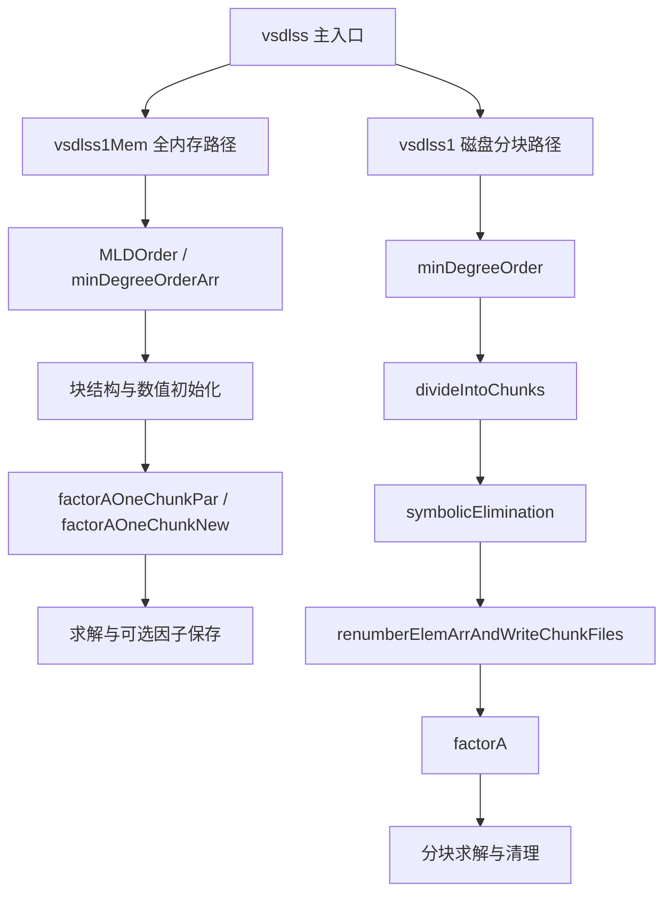

# 求解器原理与反编译证据

## 1. 能够确认什么

当前 `reference/funcs` 实际有 688 个 C 文件。它们带有 Ghidra 输出的函数名、地址、机器码大小和推断签名。尚未逐个恢复类型，也未重新验证旧 README 中“665 个可编译”的历史数字。

能够确认存在排序、符号消元、全内存分解、磁盘分块分解和三角求解路径。现有重建核心使用实对称正定矩阵的 Cholesky。原版完整支持范围，尤其一般非对称 LU、主元策略和部分分解语义，尚未由本轮证据证明，不应沿用旧 README 的断言。

## 2. 原版关键流程

以下是控制流摘要，省略初始化、错误退出和可选分支，不是完整调用图。

| 证据文件（相对项目根目录） | 直接可见行为 | 不能据此推断 |
|---|---|---|
| `reference/funcs/vsdlss.c` | 调用 `vsdlss1Mem_vsdlss` 和 `vsdlss1_vsdlss` | 所有模式参数的精确含义 |
| `reference/funcs/vsdlss1Mem_vsdlss.c` | MLD/最小度排序、初始化因子、串行或并行分解、部分分解分支 | 与现有重建 API 二进制兼容 |
| `reference/funcs/vsdlss1_vsdlss.c` | 排序、内存预算、分块、符号消元、矩阵重编号后数值分解 | 可以忽略分块文件管理 |
| `reference/funcs/symbolicElimination_vsdlss.c` | 置换图、转换图表示、写块索引、生成 affected-by-chunk 依赖 | 只是计算一个消元树 |
| `reference/funcs/factorA_vsdlss.c` | 装入当前块、应用前块贡献、块内消元、写因子、释放块 | 等价于重建中二参数 `factorA_vsdlss` |
| `reference/funcs/factorAOneChunkNew_vsdlss.c` | 对 1/2/3 行块使用专门内核，其余块调用 `factorWithinBlock_r` 及更新函数 | 所有数值字段已正确恢复 |
| `reference/funcs/solveLoadCase_vsdlss.c` | 顺序更新及反向代入；索引和值数组分离；有连续区间快速分支 | 其存储必然是标准 LLᵀ 布局 |

注意：`factorWithinBlock_r` 等被调函数的源码未在本轮确认。当前目录也没有旧文档所引用的 `denseCholesky.c`；不能假定函数依赖闭包已经齐全。

## 3. 第一阶段采用的数学模型

求解 `A x = b`，其中 A 为实对称正定矩阵。Cholesky 在精确算术中给出 `A = L Lᵀ`，L 为正对角下三角矩阵。先解 `L y = b`，再解 `Lᵀ x = y`。无需计算 A 的逆。

标准算法与适用条件可参考 [LAPACK DPOTRF](https://netlib.org/lapack/explore-html/d2/d09/group__potrf_ga84e90859b02139934b166e579dd211d4.html) 和 [DPOTRS](https://www.netlib.org/lapack/explore-html/d3/dc8/group__potrs_ga70a04d13ff2123745a26b1e236212cf7.html)。它们用于校核数学约定，不是原 VSDLSS 的实现来源证明。

### 排序与置换

消去一个变量，会在其未消去邻居之间引入填充。排序影响因子非零数、内存和工作量，不应改变原坐标系中的解。

统一约定 `q[new] = old`、`pinv[old] = new`，并满足 `pinv[q[k]] = k`。令 `P[new, q[new]] = 1`，则：

`C = P A Pᵀ`，`b_new = P b`，`C = L Lᵀ`，求得 z 后 `x = Pᵀ z`。

现有 `vsdlss_rcm` 返回 old→new，但调用方又求逆后当作 pinv 使用。只要矩阵与右端同步置换，仍可能得到正确解，却不是承诺的排序。因此必须独立验证置换方向，不能只测最终残差。

RCM 用按度排序的广度优先遍历和反向编号，主要针对带宽；最小度排序需更新消元产生的邻接关系；嵌套剖分需找到分隔集，递归处理互不相连的子域，最后处理分隔集。单纯 BFS 对半切开不构成完整嵌套剖分。

### 符号分析

只使用稀疏结构预测 L 的结构，避免数值分解中反复扩容。消元树描述列之间的依赖；对输入列沿树求 reach，确定该步需要哪些已分解列。现有 `vsdlss_cholcounts` 为每个 reach 命中的列累计条目并增加对角项，再前缀求和得到 `cp`。

结构预测可能保留数值抵消后的零，这是正常现象。符号分析必须使用与数值分解相同的置换和规范化矩阵。

### 数值分解

稠密公式便于理解：

`L[k,k] = sqrt(C[k,k] - Σ(j<k) L[k,j]²)`

`L[i,k] = (C[i,k] - Σ(j<k) L[i,j] L[k,j]) / L[k,k]`。

稀疏实现通过 reach 只访问相关列。现有 `vsdlss_chol` 在工作向量中装入 C 的一列，逐列三角更新，把得到的 `L[k,i]` 写入 L 的第 i 列。

有限精度下必须拒绝非有限数和非正主元；正对角输入不等于正定矩阵，例如 `[[1,2],[2,1]]` 仍不定。病态问题的小残差也不保证小前向误差。

### 分块原理

对块矩阵，先分解 `A11=L11 L11ᵀ`，求 `L21=A21 L11⁻ᵀ`，再更新 Schur 补 `S=A22-L21 L21ᵀ`。将相似列结构合并可使用稠密内核；磁盘分块则把矩阵和因子按内存预算装入、更新及写回。

这是解释 `effectWithinChunk` / `effectOfFromChunkOnToChunk` 的数学框架，不代表已经恢复原版块内格式或调度策略。

## 4. 数据模型与已恢复的布局证据

新核心现有 `vsdlss` 类型采用 CSC：`p[n+1]` 为列起止位置，`i[nnz]` 为行号，`x[nnz]` 为 double。输入存上三角（i≤j），索引 0-based；`nz=-1` 表示压缩列形式。原版许多向量从偏移 4 或 8 后开始访问，表现出 1-based 布局；不能直接传入新核心数组。

| 原版结构证据 | 已确认布局 | 恢复状态 |
|---|---|---|
| `newFactorBlockHeader_vsdlss.c` | 分配 0x38 字节；0x18/0x20 是 8 字节零字段；0x28/0x30 写入 IP/FP 向量返回值 | 宽度已确认；所有字段语义未确认 |
| `newFactorChunk_vsdlss.c` | 分配请求 0x70；0x00..0x1c 放 tag/计数/区间；0x20/0x28/0x30/0x38 放 8 字节向量句柄；后部还有状态和指针 | 不能用当前 48 字节重建块结构代替 |
| `solveLoadCase_vsdlss.c` | 0x28 是每列计数向量；0x30/0x38 取索引/数值向量表 | 具体因子归一化需继续追踪生产者 |

Windows 64 位不能依赖 `long` 保存指针；新代码用真实指针，磁盘格式用显式定宽整数。原始地址布局与新内部结构分别记录，不为了同名而伪造 ABI。

## 5. 反编译不可直接执行的原因

`solveLoadCase_vsdlss` 出现 `(double)((ulong)value ^ DAT_00abd200)`。这可能源于浮点符号位操作，但还未读取常量和汇编确认；把它当普通数值转换加 XOR 会改变语义。修复需要原始指令和数据段，不能无证据替换。

旧 `PLAN_C_RESULT.md` 记录了数值类型丢失和运行失败；其“不可修复”的绝对结论并不成立。可依据汇编、常量及数学不变量修复，但当前文件集不足以证明已经完成。共享库和静态库的存在也不证明可作为可靠数值基准。

## 6. 验证原则

保存原始 A、b，独立计算 `r=b-Ax` 与后向误差：

`eta = ||r||∞ / (||A||∞ ||x||∞ + ||b||∞)`。

分母为零且残差为零时定义 eta=0，否则报告异常。还要独立比较 `PAPᵀ` 与 `LLᵀ`、置换双射、符号容量、失败行为和因子重复求解。

不能只用全 1 解：它无法有效揭示置换错误。首阶段使用非恒定、含正负值的已知解，并辅以独立稠密参考计算。原版对照测试需可执行原始程序、依赖和真实输入样本；当前均未完成确认。
