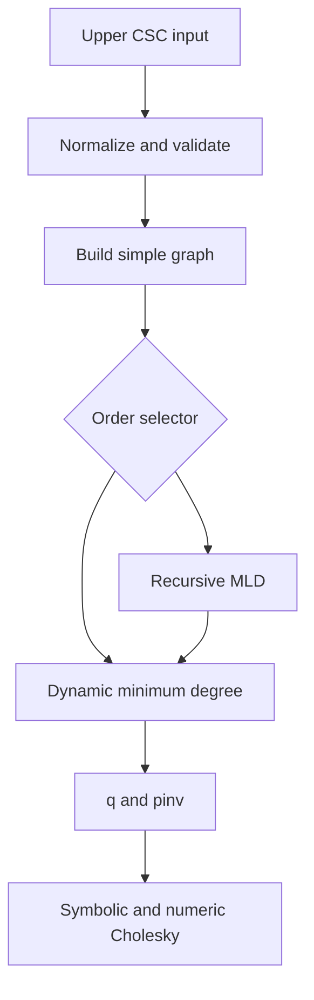

# M2 Ordering Reconstruction Design

## Status and purpose

M1 provides a verified in-memory double-precision SPD sparse Cholesky solver. M2 reconstructs the next evidenced stage of the original VSDLSS pipeline: fill-reducing ordering. It adds a correct dynamic minimum-degree ordering first, then a self-contained multilevel nested-dissection (MLD) ordering whose leaf subproblems use that minimum-degree kernel.

This is an algorithmic reconstruction from the behavior and responsibilities visible in `reference/`; it is not a line-by-line translation and does not restore the proprietary ABI, global memory manager, or opaque data layouts.

## Evidence boundary

The following recovered symbols establish the intended stages:

- `minDegreeOrder_vsdlss` dispatches graph ordering to a bucket-priority-queue minimum-degree routine.
- `minDegreeOrderArr_vsdlss` selects a low-degree specialization before a general bucket minimum-degree routine.
- `MLDOrder_vsdlss` constructs the MLD ordering context, invokes the internal ordering, and validates the resulting permutation.
- `MLDOrderInternal_vsdlss` exposes recursive multilevel ordering responsibilities, including graph work vectors and final reordering.
- `vsdlss1Mem_vsdlss` selects `MLDOrder_vsdlss` or `minDegreeOrderArr_vsdlss` before factor construction.
- `vsdlss1_vsdlss` runs `minDegreeOrder_vsdlss` before symbolic elimination and chunking.

The recovered parameter types and internal layouts are incomplete. M2 therefore reproduces mathematical invariants and pipeline position, not undocumented byte layouts or exact tie-breaking.

## Scope

M2 includes:

1. An exact dynamic minimum-degree algorithm for a simple undirected graph derived from normalized upper-triangular CSC input.
2. Deterministic fill-edge insertion and degree recomputation after every eliminated vertex.
3. Ordering statistics sufficient to compare strategies without performing numeric factorization.
4. A recursive nested-dissection framework with deterministic graph bisection, an explicit separator, and minimum-degree leaf ordering.
5. Integration with the existing factor API as new order selectors.
6. Correctness, structural, and comparative regression tests.

M2 excludes:

- quotient-graph or indistinguishable-node compression optimizations;
- exact reproduction of the recovered bucket/hash container layouts;
- low-degree numeric pre-factorization and reduced-RHS/result recovery (M3);
- supernodes, blocked numeric kernels, threading, and out-of-core files (M3/M4);
- claims that a given heuristic minimizes fill globally.

## Public contract

The existing convention remains unchanged:

- `q[new] = old`;
- `pinv[old] = new`;
- input is a normalized or normalizable real symmetric upper-CSC matrix;
- ordering never changes numeric values or the caller-owned matrix;
- every successful ordering is a complete bijection over `[0,n)`.

Order selectors are extended as follows:

| Selector | Meaning |
|---:|---|
| `0` | default, MLD after M2 is complete |
| `1` | RCM |
| `2` | natural order |
| `3` | dynamic minimum degree |
| `4` | multilevel nested dissection with minimum-degree leaves |

During the first M2 commit, selector `0` continues to mean RCM. It changes to MLD only in the final M2 integration commit, together with tests and documentation. Selectors `1` and `2` retain their M1 meanings.

The public header adds:

```c
typedef struct vsdlss_order_stats {
    csi predicted_nnz_l;
    csi fill_edges_added;
    csi elimination_tree_height;
    csi separator_count;
} vsdlss_order_stats;

vsdlss_status vsdlss_order_analyze(const vsdlss *A, int order,
                                   csi **q, csi **pinv,
                                   vsdlss_order_stats *stats);
```

`vsdlss_order` remains as the simple entry and delegates to `vsdlss_order_analyze` with a null statistics pointer.

## Graph representation

`src/vsdlss_graph.c` owns a mutable simple undirected graph used only during ordering. It is built from off-diagonal matrix structure; diagonal entries are ignored. Duplicate edges cannot survive construction. Self-edges are rejected by matrix normalization rules except for the diagonal representation.

The first correct implementation uses one sorted dynamic neighbor vector per vertex plus an `active` vector. This favors auditability and exact fill semantics over asymptotic optimality. All size additions and allocations use checked `csi`/`size_t` conversions. A later milestone may replace the representation without changing ordering APIs.

For eliminating active vertex `v`:

1. collect its active neighbors `N(v)`;
2. connect every missing pair in `N(v)` and count each new undirected fill edge once;
3. mark `v` inactive;
4. recompute affected active degrees from actual active adjacency;
5. select the next minimum-degree vertex, breaking ties by original vertex index.

This is an exact elimination-graph minimum-degree heuristic, unlike the deleted placeholder which merely decremented degrees of existing neighbors.

## Dynamic minimum-degree ordering

`src/vsdlss_min_degree.c` implements the elimination loop. The initial implementation may scan all active vertices to find the deterministic minimum; correctness is prioritized over a bucket queue. The graph module is the only component allowed to insert fill edges.

Statistics are derived from the same elimination events:

- `predicted_nnz_l` starts at `n` for the diagonal and adds the active degree of each eliminated vertex;
- `fill_edges_added` counts structural edges inserted into the elimination graph;
- elimination-tree height is computed independently by applying the final permutation to the normalized matrix and using the existing symbolic tree routine.

The tests compare `predicted_nnz_l` with the actual `L->p[n]` produced by M1 Cholesky. Equality is required for every tested SPD matrix.

## Multilevel nested dissection

`src/vsdlss_mld.c` recursively orders an induced active vertex set:

1. For subgraphs at or below a fixed leaf threshold of 32 vertices, run dynamic minimum degree locally.
2. For larger connected subgraphs, choose a deterministic pseudo-peripheral seed with BFS sweeps.
3. Partition by BFS levels around the middle level; the middle level is the separator.
4. If either side is empty or exceeds 7/8 of the non-separator vertices, use a deterministic balanced fallback based on BFS order and move boundary vertices into the separator until no cross-side edge remains.
5. Recurse on the left and right induced subgraphs.
6. Order separator vertices last using dynamic minimum degree on the separator-induced elimination problem.
7. Concatenate `left, right, separator`.

Disconnected input is split into connected components first. Components are ordered by increasing smallest original vertex index, and isolated vertices are valid one-vertex leaves. The algorithm records the total number of vertices assigned to separators.

This reproduces the original multilevel/partition/separator/minimum-degree architecture. It does not claim the same partition quality or randomization as the proprietary implementation.

## Integration and data flow



Ordering failures return `VSDLSS_ERR_INVALID`, `VSDLSS_ERR_OOM`, or `VSDLSS_ERR_UNSUPPORTED` and leave both output pointers null. Statistics are written only on success. Factorization retains its transactional behavior: no partially initialized factor escapes.

## Testing and acceptance

All production behavior is implemented test-first.

### Minimum-degree correctness

- A graph where the static initial-degree order differs from dynamic minimum degree proves degree updates include fill.
- A small graph is checked against an independent dense boolean elimination oracle, including exact deterministic order and fill count.
- Paths, cycles, stars, disconnected components, isolated vertices, and duplicate/unsorted CSC input produce valid permutations without input mutation.
- For multiple small SPD patterns, predicted `nnz(L)` equals actual `nnz(L)`.

### MLD structural properties

- Every recursive result is a valid permutation.
- Removing the reported top separator leaves no edge between left and right partitions in dedicated graph fixtures.
- Disconnected graphs retain every vertex exactly once.
- A 2-D grid produces a nonempty separator and factors to the same numerical solution as natural, RCM, and minimum-degree orderings.

### Numerical and comparative checks

- For nonconstant alternating-sign solutions, every selector has backward error at most `1e-12` on well-conditioned fixtures.
- `P A P^T` and `L L^T` agree within the existing `1e-12` normalized infinity-norm threshold.
- Minimum degree must not produce more `nnz(L)` than natural order on the selected grid and arrowhead regression fixtures. No universal superiority requirement is imposed.
- MLD reports `nnz(L)`, tree height, separator count, ordering time, and factor time in the demo benchmark; timing is informational and has no pass/fail threshold.

### Safety checks

- Allocation and arithmetic overflow paths return an error without leaks.
- ASan and UBSan run across all ordering tests.
- Strict C11 compilation with `-Wall -Wextra -Werror` remains clean.

## Documentation and evidence mapping

M2 updates the reconstruction roadmap, continuation record, and README selector table. A mapping table records each recovered responsibility, reconstructed function, validating test, and confidence level. Claims are limited to behavior exercised by tests or directly evidenced by the recovered control flow.

## Milestone boundary

M2 is complete when selectors 0/1/2/3/4 are stable, all ordering and solver tests pass, statistics agree with actual symbolic/numeric structure, and the documentation clearly separates reconstructed principles from proprietary implementation details.

M3 then implements the evidenced degree-1/2/3 numeric pre-elimination path, including Schur updates, reduced RHS construction, reduced solve, and reverse recovery.
